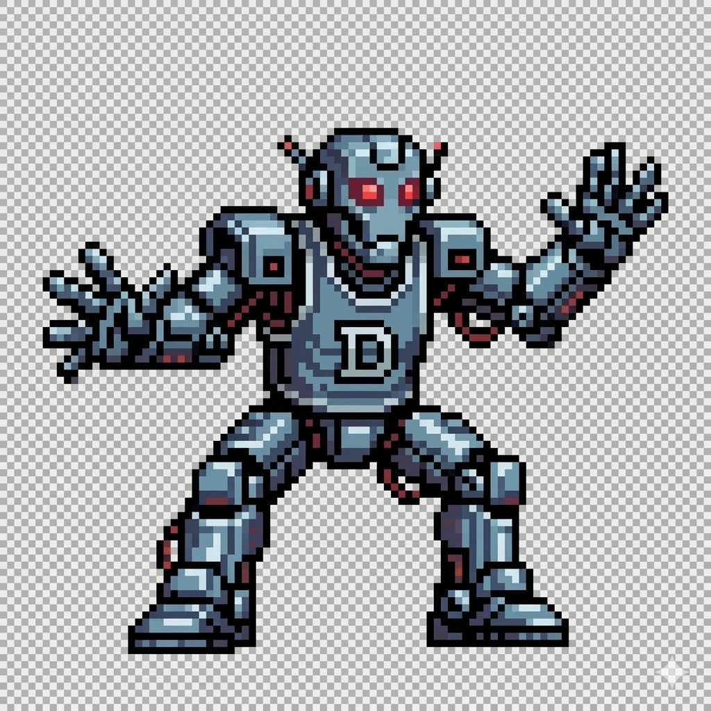

<p align="center">
  <picture>
    <source media="(prefers-color-scheme: dark)" srcset="assets/logo.png">
    <source media="(prefers-color-scheme: light)" srcset="assets/logo.png">
    
  </picture>
</p>

# Basketball Player Detection - Robot Defender

Systeme de vision par ordinateur pour robot defenseur de basketball. Le projet detecte en temps reel les joueurs tenant un ballon et transmet les coordonnees du centre de leur bounding box via ROS 2 pour permettre au robot de se positionner comme un defenseur face au porteur du ballon.

## Objectif

Le robot doit :
1. **Detecter** quand une personne tient un ballon de basket (classification "basketball player")
2. **Recuperer** les coordonnees du centre de la bounding box du joueur
3. **Transmettre** ces coordonnees via ROS 2 aux composants du robot
4. **Orienter** le servo moteur vers le joueur detecte
5. **Se deplacer** pour rester face au porteur du ballon (en cours)

## Principe de detection

Le systeme utilise deux modeles YOLO en parallele :

| Modele | Fichier | Role |
|--------|---------|------|
| **COCO** | `yolo26n` | Detection des personnes (classe 0) |
| **Custom** | `ballDetection` | Detection des ballons de basket |

**Regle de classification** : Une personne est identifiee comme **"basketball player"** si le centre d'un ballon detecte se trouve a l'interieur de sa bounding box.

## Architecture ROS 2

```
[ publisher_node ]              [ servo_node ]           [ subscriber_node ]
  basketball_detection            controller               controller
  - Webcam                        - Abonne /basketball_player
  - YOLO detection                - wiringPi softPwm       - Placeholder moteurs
  - Publie /basketball_player     - GPIO 18 -> Servo       - Logique direction
         |                              ^                        ^
         +------------------------------+------------------------+
                    geometry_msgs/Point (x, y)
```

| Noeud | Package | Role |
|-------|---------|------|
| `publisher_node` | `basketball_detection` | Detection YOLO + publication coordonnees |
| `servo_node` | `controller` | Controle servo moteur sur GPIO 18 |
| `subscriber_node` | `controller` | Controle moteurs de deplacement (a implementer) |

| Topic | Type | Description |
|-------|------|-------------|
| `/basketball_player` | `geometry_msgs/msg/Point` | Coordonnees (x, y) du centre de la bounding box du joueur |

## Versions disponibles

| Version | Performance | Format modeles | Cas d'usage |
|---------|-------------|----------------|-------------|
| **ROS 2** | 5-10 FPS | ONNX | Integration robot (recommandee) |
| **C++ standalone** | 5-10.4 FPS | ONNX | Tests sans ROS |
| **Python** | 4-9.4 FPS | PyTorch | Prototypage |

## Structure du projet

```
ball_detection/
├── config/
│   ├── config.ini              # Configuration (chemins Docker)
│   └── config_cpp.ini          # Configuration (chemins locaux)
├── cpp/                        # Version C++ standalone
│   └── build/
├── ros2_ws/                    # Workspace ROS 2
│   └── src/
│       ├── basketball_detection/   # Detection YOLO (publisher)
│       │   ├── CMakeLists.txt
│       │   ├── package.xml
│       │   ├── include/basketball_detection/
│       │   │   ├── Config.hpp
│       │   │   ├── YOLODetector.hpp
│       │   │   ├── Capture.hpp
│       │   │   ├── Detection.hpp
│       │   │   └── Utils.hpp
│       │   └── src/
│       │       ├── publisher_node.cpp
│       │       ├── Config.cpp
│       │       ├── YOLODetector.cpp
│       │       ├── Capture.cpp
│       │       └── Utils.cpp
│       └── controller/             # Controle robot (subscribers)
│           ├── CMakeLists.txt
│           ├── package.xml
│           ├── include/
│           │   └── Config.hpp
│           └── src/
│               ├── servo_node.cpp      # Controle servo GPIO 18
│               ├── subscriber_node.cpp # Controle moteurs (TODO)
│               └── Config.cpp
├── servo/                      # Tests servo standalone
│   ├── main.cpp                # Test wiringPi
│   ├── main.py                 # Test gpiozero
│   └── src/
│       └── main.cpp            # Test pigpio
├── python/                     # Version Python
│   ├── detect.py
│   └── requirements.txt
├── models/                     # Modeles YOLO (.pt et .onnx)
├── docker/
│   ├── dockerfile_cpp
│   ├── dockerfile_python
│   └── compose.yaml
├── utils/
│   └── export_models_to_onnx.py
├── launch_ros.sh               # Script de lancement Docker
├── tests/
├── .gitignore
└── README.md
```

---

## Lancement rapide (Docker + ROS 2)

C'est la methode recommandee pour faire tourner le systeme complet.

### Prerequis

- Docker & Docker Compose
- Webcam
- Raspberry Pi ou machine avec GPIO (pour le servo)

### Lancement automatique

```bash
./launch_ros.sh
```

Ce script :
1. Demarre le conteneur Docker (`ball_detection_ros`) en mode privilegie
2. Compile les packages `basketball_detection` et `controller` avec colcon
3. Lance `publisher_node` (detection + publication sur `/basketball_player`)
4. Lance `servo_node` (abonne a `/basketball_player`, controle le servo sur GPIO 18)

Appuyez sur **Ctrl+C** pour arreter les deux noeuds.

### Lancement manuel (etape par etape)

**1. Demarrer le conteneur**
```bash
docker compose -f docker/compose.yaml up -d
```

**2. Entrer dans le conteneur**
```bash
docker exec -it ball_detection_ros bash
```

**3. Compiler le workspace**
```bash
source /opt/ros/humble/setup.bash
cd /workspace/ball_detection/ros2_ws
colcon build --packages-select basketball_detection controller
source install/setup.bash
```

**4. Lancer le noeud de detection** (terminal 1)
```bash
ros2 run basketball_detection publisher_node \
    --ros-args -p config_path:=/workspace/ball_detection/config/config.ini
```

**5. Lancer le noeud servo** (terminal 2)
```bash
docker exec -it ball_detection_ros bash
source /opt/ros/humble/setup.bash
source /workspace/ball_detection/ros2_ws/install/setup.bash
ros2 run controller servo_node \
    --ros-args -p config_path:=/workspace/ball_detection/config/config.ini
```

### Ecouter le topic

```bash
ros2 topic echo /basketball_player
```

---

## Installation - Version C++ standalone

### Prerequis

- CMake 3.10+
- Compilateur C++17
- OpenCV 4.x
- ONNX Runtime (inclus dans `deps/`)

### Compilation et execution

```bash
cd cpp
mkdir -p build && cd build
cmake ..
make
./detectBasketBallPlayer
```

---

## Installation - Version Python

### Prerequis

- Python 3.8+
- Webcam

### Installation et execution

```bash
pip install -r python/requirements.txt
python python/detect.py
```

---

## Configuration

Fichier : `config/config.ini`

```ini
[default]
log_level = DEBUG
webcam_index = 0
confidence_threshold = 0.5
PERSON_MODEL_PATH = models/yolo26n.onnx
BASKET_MODEL_PATH = models/ballDetection.onnx
FRAME_WIDTH = 640
FRAME_HEIGHT = 480

[Visualisation]
draw_balls = True
draw_players = True
```

| Parametre | Description | Defaut |
|-----------|-------------|--------|
| `webcam_index` | Index de la webcam | `0` |
| `confidence_threshold` | Seuil de confiance YOLO | `0.5` |
| `FRAME_WIDTH` | Largeur de la frame | `640` |
| `FRAME_HEIGHT` | Hauteur de la frame | `480` |
| `draw_balls` | Afficher les ballons | `True` |
| `draw_players` | Afficher les joueurs | `True` |

## Conversion des modeles

Pour convertir les modeles PyTorch vers ONNX (requis pour C++ et ROS 2) :

```bash
python utils/export_models_to_onnx.py
```

## Affichage visuel

| Couleur | Signification |
|---------|---------------|
| **Bleu** | Personne sans ballon |
| **Vert** | Basketball player (personne avec ballon) |
| **Orange** | Ballon de basket detecte |

## Servo moteur

Le dossier `servo/` contient des scripts de test standalone pour le servo moteur (GPIO 18) :

| Fichier | Librairie | Usage |
|---------|-----------|-------|
| `servo/main.cpp` | wiringPi (softPwm) | Balayage servo |
| `servo/src/main.cpp` | pigpio | Positions 0/90/180 degres |
| `servo/main.py` | gpiozero | Test min/mid/max |

Le controle servo en production se fait via le noeud ROS 2 `servo_node` qui mappe la position X du joueur detecte sur l'angle du servo (0-180 degres).

## TODO

- [x] Envoi des donnees sur un topic ROS 2
- [x] Noeud subscriber servo moteur (`servo_node`)
- [ ] Entrainer le modele avec des nouvelles donnees (balle floue en dribble, balle dans les mains)
- [ ] Estimer la distance du joueur
- [ ] Noeud subscriber pour les moteurs de deplacement
- [ ] Lancement via launch file ROS 2

## Modele custom

Le modele de detection de ballon a ete entraine via la plateforme Ultralytics.

## Licence

MIT
